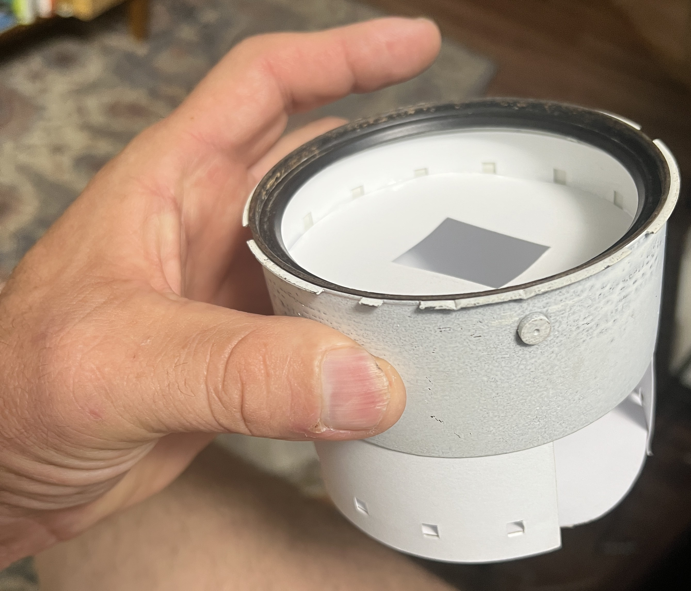
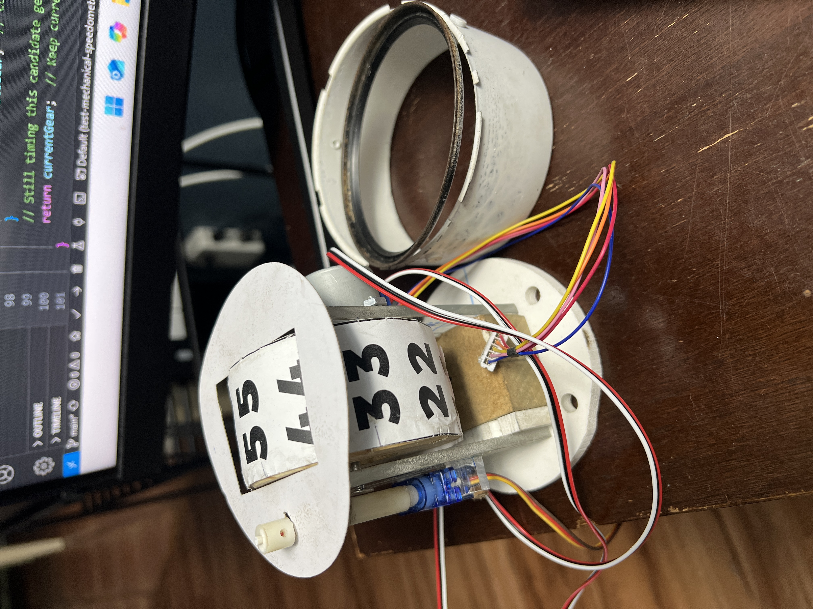

# ESP32 Mechanical Speedometer

A realistic mechanical speedometer and gear indicator system for classic cars, built with ESP32 and authentic automotive components. Designed specifically for a 1970 MGB with three-speed manual transmission.

## Features

- **Realistic Gear Detection**: Analyzes engine and driveshaft RPM to intelligently determine current gear
- **Smooth Transitions**: Servo and stepper motors use cubic easing for natural movement
- **Stability Logic**: 750ms confirmation timeout prevents erratic display during gear shifts
- **Authentic Specifications**: Uses actual 1970 MGB transmission ratios and tire specifications
- **Non-blocking Architecture**: All components use update() methods for responsive operation

## Hardware Components

### Microcontroller
- **ESP32 Development Board** with integrated 0.96" OLED display, CH340 driver, WiFi+BLE

### Motors & Sensors
- **28BYJ-48 Stepper Motor** with ULN2003 driver board (speedometer needle)
- **DM-S0020 Ultra-Micro Servo** (gear position indicator)
- **Optical Endstop Sensors** with 1M cable for speedometer homing

### Vehicle Specifications (1970 MGB)
- **Transmission Ratios**: R:3.44, 1st:3.44, 2nd:2.21, 3rd:1.37
- **Differential Ratio**: 3.9:1
- **Tire Size**: 165-80R13 (23" diameter)

## Software Architecture

### Core Classes

#### `RPMHandler`
Central controller that processes engine and driveshaft RPM inputs to determine:
- Current vehicle speed (calculated from driveshaft RPM and tire specs)
- Optimal gear selection (derived from RPM ratios)
- Stability timeouts during gear changes

#### `GearIndicator`
Controls servo-driven gear position display:
- Smooth 800ms cubic easing transitions
- Positions: Reverse (0°), Neutral (15°), 1st (30°), 2nd (45°), 3rd (60°)
- Non-blocking update() method for main loop integration

#### `SpeedometerWheel`
Manages stepper motor speedometer:
- Optical endstop homing for precise calibration
- Smooth 1200ms cubic easing for speed changes
- Speed range: 0-90 MPH with 2048 steps per revolution
- Shortest-path rotation logic for efficient movement

## Hardware Photos

### CAN Bus Interface View

*CAN bus interface components and connections for reading engine RPM data*

### Servo Mechanism View

*Servo-driven gear position indicator mechanism showing physical implementation*

> **📋 Technical Details**: Complete wiring diagrams and connection tables are available in [docs/wiring-diagram.md](docs/wiring-diagram.md). For Fritzing diagrams and PCB layouts, see [docs/fritzing-parts-list.md](docs/fritzing-parts-list.md).

## Pin Configuration

```cpp
// Servo Control
#define SERVO_PIN 18          // PWM pin for gear indicator servo

// Stepper Motor Control
#define STEPPER_PIN_1 19      // Stepper motor phase 1
#define STEPPER_PIN_2 21      // Stepper motor phase 2
#define STEPPER_PIN_3 22      // Stepper motor phase 3
#define STEPPER_PIN_4 23      // Stepper motor phase 4

// Sensors
#define ENDSTOP_PIN 5         // Optical endstop for speedometer homing

// OLED Display (I2C)
#define OLED_SDA 4            // I2C data pin
#define OLED_SCL 15           // I2C clock pin
#define OLED_RST 16           // Display reset pin
```

## Usage

### Basic Setup
```cpp
#include "classes/RPMHandler.h"
#include "classes/GearIndicator.h"
#include "classes/SpeedometerWheel.h"

GearIndicator gearIndicator;
SpeedometerWheel speedometer;
RPMHandler rpmHandler(&gearIndicator, &speedometer);

void setup() {
    gearIndicator.begin();
    speedometer.begin();
    speedometer.calibrateHome();  // Calibrate speedometer on startup
}

void loop() {
    // Get RPM readings from your sensors
    float engineRPM = readEngineRPM();
    float driveshaftRPM = readDriveshaftRPM();

    // Update system with current RPM values
    rpmHandler.update(engineRPM, driveshaftRPM);

    // Maintain smooth transitions
    gearIndicator.update();
    speedometer.update();

    delay(10);  // 100Hz update rate
}
```

### Manual Control
```cpp
// Direct gear control
gearIndicator.setGear(GEAR_2);

// Direct speed control
speedometer.moveToMPH(45);

// Check status
if (!gearIndicator.isInTransition()) {
    Serial.println("Gear change complete");
}
```

## Build Instructions

1. **Hardware Setup**: Connect components according to pin configuration
2. **Software**: Upload code using PlatformIO
3. **Calibration**: System automatically calibrates speedometer on first boot
4. **Testing**: Use demo mode or connect to actual vehicle RPM sensors

### PlatformIO Commands
```bash
# Build project
pio run

# Upload to ESP32
pio run --target upload

# Monitor serial output
pio device monitor --baud 115200
```

## Development History

### Commit Log

- **a5d2799** - Add RPMHandler class with gear stability detection and smooth transitions
  - Created RPMHandler class with 1970 MGB transmission specifications
  - Added gear stability timeout logic (750ms confirmation period)
  - Implemented smooth easing transitions for both gear indicator and speedometer
  - Updated constructor formatting to tab-indented one-per-line style
  - Added intelligent gear detection that handles shifting scenarios

- **8edfc03** - Update Claude Code settings
  - Updated development environment configuration

- **5a6fd23** - Initial commit: ESP32 mechanical speedometer project
  - ESP32 with integrated OLED display support
  - SpeedometerWheel class for stepper motor control with optical endstop
  - GearIndicator class for servo-controlled gear display
  - Configuration for 28BYJ-48 stepper motor and DM-S0020 servo
  - GPIO pin definitions and gear enum system
  - PlatformIO configuration with all required libraries

## Technical Details

### Gear Detection Logic
The system determines gear selection by:
1. Calculating actual transmission ratio from engine/driveshaft RPM
2. Comparing against known MGB transmission ratios
3. Requiring 750ms stability before confirming gear changes
4. Defaulting to NEUTRAL during shifts or when ratios don't match

### Smooth Movement System
Both motors use cubic easing curves:
- **Acceleration phase**: Gradual speed increase
- **Constant phase**: Steady movement
- **Deceleration phase**: Smooth approach to target

This creates natural, realistic movement that mimics actual mechanical gauges.

## License

This project is designed for educational and hobbyist use with classic automotive restoration projects.

## Contributing

Contributions welcome! Please follow the established code style guidelines in CLAUDE.md.